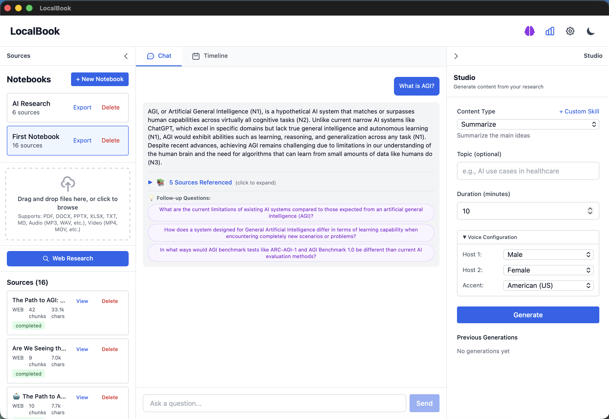

# LocalBook

**Your documents, your AI, your machine.** A private, offline alternative to cloud-based AI assistants.

  



## What is LocalBook?

LocalBook lets you **chat with your documents** using AI — completely offline and private. Upload PDFs, Word docs, web pages, or YouTube videos, then ask questions and get answers with exact citations.

**Think of it like ChatGPT, but:**
- 🔒 **100% Private** — Everything runs on your Mac, nothing sent to the cloud
- 📚 **Your Documents** — AI answers come from YOUR files, not the internet
- 🎙️ **Podcast Generator** — Turn your documents into conversational audio podcasts
- 💰 **Free** — No subscriptions, no API costs (uses free local AI models)

### What Can You Do?

| Feature | Description |
|---------|-------------|
| 💬 **Ask Questions** | Chat with your documents in plain English, get answers with page citations |
| 📄 **Upload Anything** | PDFs, Word, PowerPoint, Excel, web pages, YouTube videos |
| 🎙️ **Generate Podcasts** | Create two-host audio discussions from your documents |
| 🔍 **Web Search** | Optionally combine your docs with real-time web results |
| 📅 **Timeline View** | Automatically extract and visualize dates/events |

---

## Installation

> **⏱️ Total Setup Time: ~20-30 minutes** (one-time setup, then instant launches)

<details>
<summary><strong>📋 What You'll Need Before Starting (click to expand)</strong></summary>

- **macOS** (required for audio features)
- **Python 3.11+** — check: `python3 --version`
- **Git** — check: `git --version`  
- **~10GB free disk space**

The following will be installed automatically during setup:
- Node.js, Rust, Ollama, ffmpeg

</details>

### Step 1: Install System Dependencies ⏱️ ~5 minutes

```bash
# Install Homebrew if not already installed (skip if you have it)
# Check first: brew --version
/bin/bash -c "$(curl -fsSL https://raw.githubusercontent.com/Homebrew/install/HEAD/install.sh)"

# Install Ollama for local LLM
brew install ollama

# Install Rust (required for Tauri) - follow the prompts, select default installation
curl --proto '=https' --tlsv1.2 -sSf https://sh.rustup.rs | sh
source $HOME/.cargo/env

# Install Node.js (if not installed - check first: node --version)
brew install node

# Install ffmpeg (required for audio/video transcription)
brew install ffmpeg
```

**Verify installations:**
```bash
ollama --version && node --version && rustc --version && ffmpeg -version | head -1
```

### Step 2: Download AI Models ⏱️ ~10-15 minutes

This step downloads the AI models (~4GB each). Time varies by internet speed.

```bash
# Start Ollama service (keep this running in a terminal)
ollama serve

# In a NEW terminal, pull the required models
# mistral-nemo: ~4.1GB download, used for main answers
ollama pull mistral-nemo

# phi4-mini: ~2.5GB download, used for fast follow-up questions  
ollama pull phi4-mini
```

**Verify models are installed:**
```bash
ollama list
# Should show both: mistral-nemo and phi4-mini
```

> **Note:** Keep `ollama serve` running in a terminal whenever you use LocalBook.

### Step 3: Clone and Set Up Backend ⏱️ ~3-5 minutes

#### Option A: Clone via Command Line (Recommended)

```bash
# First, navigate to where you want to store the project
# Common locations: ~/Projects, ~/Developer, ~/Code, or ~/Desktop
cd ~/Projects  # or wherever you prefer

# Clone the repository (downloads the code to your computer)
git clone https://github.com/patsteph/LocalBook.git

# Enter the project folder
cd LocalBook
```

#### Option B: Download ZIP (Alternative for Git Beginners)

1. Go to https://github.com/patsteph/LocalBook
2. Click the green **"Code"** button
3. Select **"Download ZIP"**
4. Extract the ZIP file to your preferred location (e.g., `~/Projects`)
5. Open Terminal and navigate to the extracted folder:
   ```bash
   cd ~/Projects/LocalBook-main  # Note: ZIP extracts with "-main" suffix
   ```

---

#### Set Up the Backend

```bash
# Verify you're in the right directory
ls -la
# Should see: backend/, src/, src-tauri/, package.json, README.md, etc.

# Navigate to the backend folder
cd backend

# Create a Python virtual environment
# (This keeps LocalBook's dependencies separate from other Python projects)
python3 -m venv .venv

# Activate the virtual environment
source .venv/bin/activate

# Your terminal prompt should now show (.venv) at the start
# Example: (.venv) user@mac backend %
# This confirms the virtual environment is active!

# Install Python dependencies (~2-3 minutes)
pip install -r requirements.txt

# (Optional) Copy and customize environment config
cp .env.example .env

# Start the backend server
python main.py
# You should see: "Uvicorn running on http://0.0.0.0:8000"
# Keep this terminal running!
```

> **Tip:** If you see import errors, make sure your virtual environment is activated (you should see `(.venv)` in your prompt). Run `source .venv/bin/activate` to activate it.

### Step 4: Set Up Frontend ⏱️ ~3-5 minutes

```bash
# Open a NEW terminal (keep the backend running in the previous one)
# Navigate to the LocalBook root directory (not backend/)
# Replace with your actual path from Step 3, for example:
cd ~/Projects/LocalBook

# Install Node.js dependencies (~1-2 minutes)
npm install

# Build and run the desktop app (~2-3 minutes for first build)
npm run tauri dev
```

**First launch notes:**
- The first build takes longer as Rust compiles the Tauri app
- A desktop window should open automatically when ready
- If you see "Waiting for localhost:8000", make sure the backend is running (Step 3)

> **🎉 Success!** You should now see the LocalBook app. Create a notebook and add some documents to get started!

---

### ✅ Setup Complete Checklist

Before moving on, verify you have these **3 terminals running**:

| Terminal | What's Running | You Should See |
|----------|----------------|----------------|
| 1️⃣ | `ollama serve` | "Listening on 127.0.0.1:11434" |
| 2️⃣ | `python main.py` (in backend/) | "Uvicorn running on http://0.0.0.0:8000" |
| 3️⃣ | `npm run tauri dev` | LocalBook app window opens |

**Quick test:** Create a notebook, upload a PDF, and ask a question. Your first query may take 30-60 seconds (model loading), but subsequent queries will be much faster (~15 seconds).

---

### Step 5: (Optional) Install Premium Voices for Audio ⏱️ ~5 minutes

For the best audio podcast quality, install premium macOS voices:

1. Open **System Settings** → **Accessibility** → **Spoken Content**
2. Click **System Voice** → **Manage Voices**
3. Download these recommended voices (~100-200MB each):
   - **Ava (Premium)** - Female US voice
   - **Evan (Enhanced)** - Male US voice
   - **Zoe (Premium)** - Female US voice (variety)
   - **Tom (Enhanced)** - Male US voice (variety)

Verify installed voices:
```bash
say -v '?'
# Look for "Ava (Premium)", "Evan (Enhanced)", etc.
```

### Step 6: (Optional) Set Up Web Search

LocalBook supports web search to supplement your local documents:

- **Brave Search API** (Recommended): 2,000 free queries/month
- **DuckDuckGo** (Fallback): Free but rate-limited

To set up Brave Search:
1. Get a free API key at https://brave.com/search/api/
2. Open LocalBook → Settings (gear icon) → Add your Brave API key

## Usage Guide

### Creating a Notebook
1. Click "New Notebook" in the sidebar
2. Give it a name and description
3. Start adding sources

### Adding Sources
- **Upload Files**: PDF, DOCX, PPTX, XLSX
- **Add Web Page**: Paste a URL to extract content
- **Add YouTube Video**: Paste a YouTube URL for transcript extraction

### Asking Questions
1. Select a notebook
2. Type your question in the chat
3. Toggle "Web Search" for real-time information
4. Get answers with citations and sources

### Generating Audio
1. Go to "Audio Studio" in a notebook
2. Choose topic and duration (5-30 minutes)
3. Select voice preferences (gender, accent)
4. Generate and download MP3 podcast

### Timeline View
1. Navigate to "Timeline" in a notebook
2. See all extracted dates and events
3. Click events to see source documents

### Custom Skills
1. Go to "Skills" in the sidebar
2. Create custom prompts for specialized tasks
3. Use skills when generating audio or content

---

## Tech Stack

<details>
<summary><strong>Click to expand technical details</strong></summary>

### Frontend
- **Framework**: React 19 + TypeScript
- **UI**: TailwindCSS + Lucide Icons
- **Desktop**: Tauri 2 (native desktop app)
- **State Management**: Zustand
- **Build Tool**: Vite

### Backend
- **API**: FastAPI (Python)
- **Vector Database**: LanceDB
- **Embeddings**: sentence-transformers
- **LLM Support**: Ollama, OpenAI, Anthropic
- **Audio**: macOS Say command with premium voices
- **Document Processing**: PyMuPDF, python-docx, pdfplumber, trafilatura
- **Video**: moviepy, youtube-transcript-api
- **Audio Transcription**: faster-whisper

</details>

## Configuration

### LLM Model Selection

**Dual-Model Architecture:**
- **mistral-nemo** (main): Generates detailed, well-cited answers
- **phi4-mini** (fast): Generates follow-up questions in parallel

This dual-model approach speeds up the overall response by running follow-up question generation concurrently with the main answer.

**Main Model: mistral-nemo**
- **Why**: Best balance of speed, quality, and local privacy
- **Performance**: ~14-18s per query with detailed, well-cited answers
- **GPU Usage**: 100% utilization on Apple Silicon

**Model Choice Reasoning:**
- ✅ **mistral-nemo**: Optimal quality/speed balance (recommended for main answers)
- ✅ **phi4-mini**: Fast and lightweight (used for follow-up questions)
- ❌ **gemma3**: Fast (~10s) but poor answer quality and citation accuracy
- ❌ **ministral-3:8b**: Very slow (60-114s) - not recommended
- ❌ **minitron**: Unstable - hangs indefinitely

### Performance Tuning for Different Models

If you want to experiment with other Ollama models, modify these files:

1. **Change the model** (`backend/services/llm_service.py:12`):
```python
def __init__(self, model_name: str = "your-model-name", provider: str = "ollama"):
```

2. **Adjust generation parameters** (`backend/services/llm_service.py:89-93`):
```python
options = {
    'temperature': 0.4,  # Lower = more focused (0.3-0.5)
    'top_p': 0.9,        # Nucleus sampling (0.85-0.95)
    # No num_predict limit for quality (add 400-700 for speed)
}
```

3. **Tune citation count** (`backend/models/chat.py:11`):
```python
top_k: Optional[int] = 5  # Lower = faster (3-7 recommended)
```

**Performance Tips:**
- **Smaller models**: Add `num_predict: 400` for speed, but expect shorter answers
- **Larger models**: Remove `num_predict` limit, increase `top_k` to 7-10
- **Speed vs Quality**: Lower `top_k` (fewer citations) = faster but less context

### Advanced Performance Tuning

Configuration can be customized via `backend/.env` (copy from `.env.example`):

```bash
# Key settings in backend/.env
CHUNK_SIZE=1000        # Smaller = more precise retrieval, larger = more context per chunk
CHUNK_OVERLAP=200      # Higher = better context continuity, but more storage
EMBEDDING_MODEL=BAAI/bge-small-en-v1.5  # Change requires re-indexing documents
OLLAMA_MODEL=mistral-nemo               # Main LLM model
```

**Chunking Strategy:**
| Use Case | CHUNK_SIZE | CHUNK_OVERLAP | Notes |
|----------|------------|---------------|-------|
| Technical docs | 800 | 150 | Smaller chunks for precise code/API answers |
| Long narratives | 1200 | 250 | Larger chunks preserve story context |
| Mixed content | 1000 | 200 | Default balanced setting |

**First Query Performance:**
- The first query after starting the backend takes longer (~30-60s) because:
  1. Embedding model downloads on first use (~100MB)
  2. Model loads into memory
- Subsequent queries are much faster (~14-18s)

**Memory Optimization:**
- Each Ollama model uses 4-8GB VRAM
- Running both `mistral-nemo` and `phi4-mini` requires ~10GB
- On systems with <16GB RAM, consider using only `mistral-nemo` (edit `rag_engine.py` to use same model for follow-ups)

### LLM Providers
Configure in Settings:
- **Ollama** (default): Local, private, free
  - Main model: `mistral-nemo`
  - Follow-up model: `phi4-mini`
- **OpenAI**: GPT-4, GPT-3.5
  - Requires API key
- **Anthropic**: Claude models
  - Requires API key

### Audio Voices
Premium macOS voices rotate automatically for variety. Download in System Settings → Accessibility → Spoken Content:

**US Voices:**
- Ava (Premium), Zoe (Premium), Samantha - Female
- Evan (Enhanced), Tom (Enhanced), Alex - Male

**UK Voices:**
- Jamie (Premium) - Female
- Daniel (Enhanced) - Male

### Supported File Types

**Documents:**
- PDF, Word (.docx), PowerPoint (.pptx), Excel (.xlsx, .xls), CSV
- Plain text (.txt, .md), HTML, Code files (.py, .js, .ts, etc.)

**Media (transcribed via Whisper):**
- Audio: MP3, WAV, M4A, OGG, FLAC, AAC, WMA
- Video: MP4, MOV, AVI, MKV, WEBM

**Web:**
- Any URL (content extracted automatically)
- YouTube videos (transcript extraction)

## Data Storage

All data is stored locally:
- **Documents**: `data/uploads/`
- **Vector Database**: `data/lancedb/`
- **Audio Files**: `data/audio/`
- **Database**: `data/structured.db` (SQLite)

## Development

### Project Structure
```
LocalBook/
├── backend/              # Python FastAPI backend
│   ├── api/             # API endpoints
│   ├── services/        # Business logic
│   ├── storage/         # Database and vector storage
│   ├── models/          # Pydantic models
│   └── utils/           # Utility functions
├── src/                 # React frontend
├── src-tauri/           # Tauri desktop app
└── data/                # Local data storage
```

### API Documentation
When the backend is running, visit:
- Swagger UI: http://localhost:8000/docs
- ReDoc: http://localhost:8000/redoc

### Building for Production
```bash
# Build desktop app
npm run tauri:build

# Output in src-tauri/target/release/
```

## Requirements

### Python Dependencies
See `backend/requirements.txt` for complete list. Key dependencies:
- fastapi, uvicorn
- sentence-transformers, torch
- lancedb, pyarrow
- ollama, openai, anthropic
- PyMuPDF, python-docx, pdfplumber
- faster-whisper, pydub
- youtube-transcript-api

### System Requirements
- **macOS**: Required for audio generation (macOS Say command)
- **Memory**: 16GB+ RAM recommended (8GB minimum, but may be slow)
- **Storage**: ~5GB for models + document storage
  - Ollama models: ~4GB each for mistral-nemo
  - Embedding model: ~100MB (downloads on first use)
  - Documents: varies by usage
- **GPU**: Apple Silicon recommended for best performance
  - Intel Macs work but are significantly slower

## Troubleshooting

### Audio Generation Issues
- Ensure you've downloaded premium voices in System Settings > Accessibility > Spoken Content
- Available voices: `say -v '?'` in terminal

### Ollama Connection Failed
```bash
# Check if Ollama is running
curl http://localhost:11434/api/tags

# Restart Ollama
ollama serve

# Verify models are installed
ollama list
# Should show: mistral-nemo, phi4-mini
```

### Slow First Query
The first query after starting is slow because the embedding model downloads and loads:
```bash
# Pre-warm the embedding model by making a test query
# Or wait ~30-60s on first query - subsequent queries will be faster
```

### Model Not Found Error
```bash
# If you see "model not found" errors, pull the required models:
ollama pull mistral-nemo
ollama pull phi4-mini
```

### Out of Memory
- Close other applications using GPU memory
- Use a smaller model: `ollama pull mistral:7b` and update `backend/config.py`
- Reduce `top_k` in queries (fewer citations = less context to process)

### Port Already in Use
```bash
# Backend (default: 8000)
python -m uvicorn main:app --reload --port 8001

# Frontend will auto-detect backend port
```

## Privacy & Security

- **100% Local Processing**: All document processing happens on your machine
- **Secure Storage**: API keys stored in system keyring (not in files)
- **No Telemetry**: No usage tracking or data collection
- **Optional Web Search**: Web search is opt-in per query

## License

See LICENSE file for details.

## Contributing

Contributions welcome! Please open an issue or PR.

## Acknowledgments

Built with inspiration from Google's NotebookLM, designed for privacy-conscious users who want local document AI without cloud dependencies.
